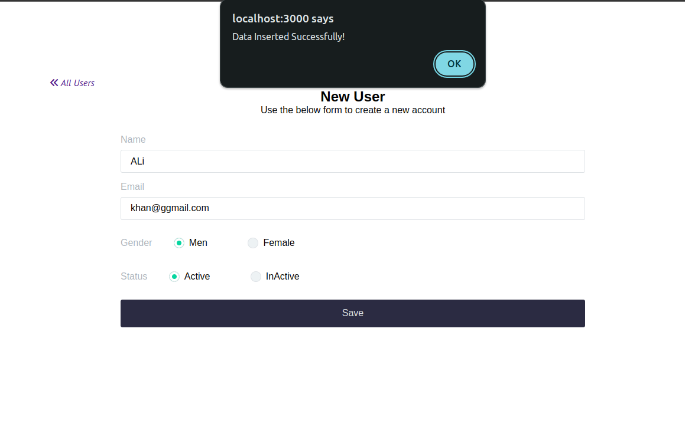
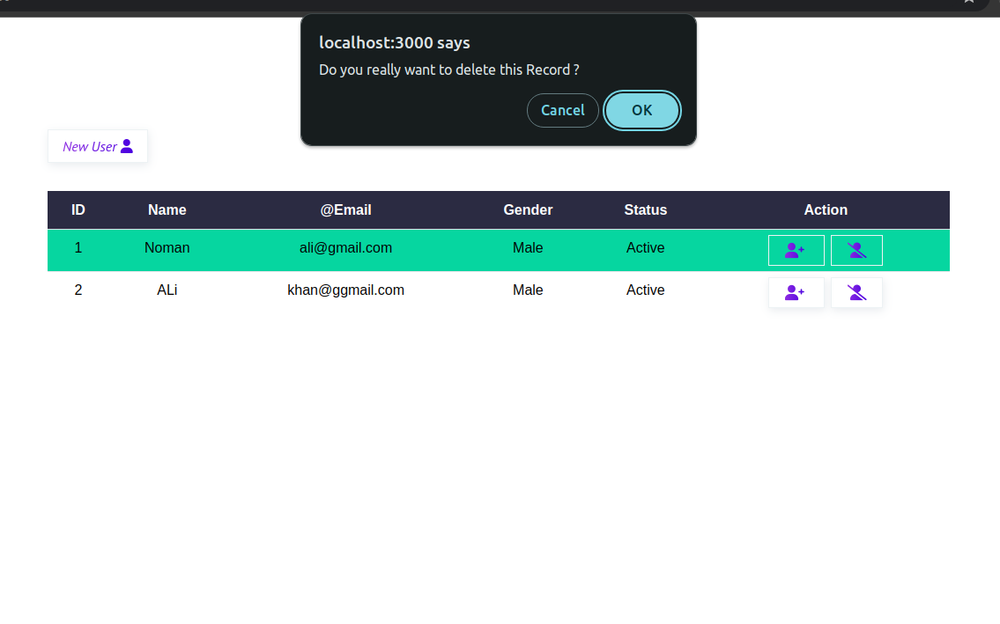
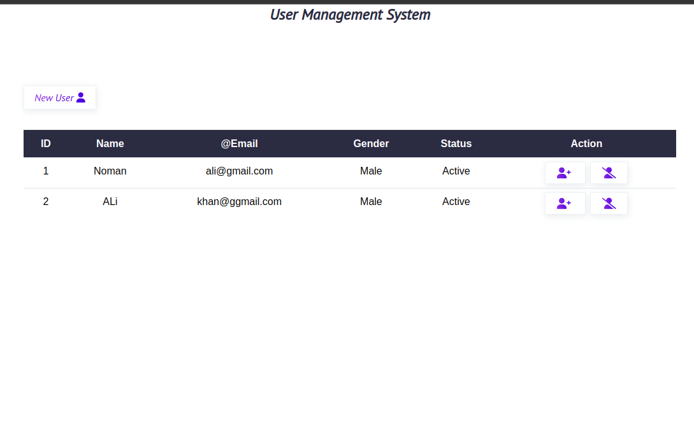

# User Management App using MERN Stack Technologies

This is a simple CRUD (Create, Read, Update, Delete) application using MongoDB. The project is built with Node.js and Express and uses Mongoose for MongoDB object modeling. The application includes features such as add Users, Delete Users, Edit Users and serving static assets.

## Funcationality

- Add Users 
- Delete Users
- Update Users

## Authors

- [@nomankhokhar](https://www.github.com/nomankhokhar)

## Badges

## 🚀 About Me

I'm a Full Stack Engineer...